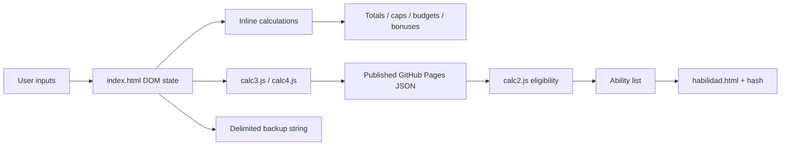

# Current Implementation Map

## Active application

`index.html` is the active browser entry point. It is a self-contained static page with inline JavaScript and HTML event handlers. It loads scripts in this required order:

1. `calc2.js`
2. `calc3.js`
3. `calc4.js`
4. `hashCode.js`
5. `getElementsByClassName-1.0.1.js`

All state is in the live DOM. There is no server API, package manager, build, test, localStorage/sessionStorage, or durable browser persistence.

## User-visible behaviour

| Area | Current behaviour |
|---|---|
| Level and XP | Adds `experienciaActual` + `experienciaNew`; consumes blocks of 100 XP and displays prospective level / levels gained. |
| Evolution | Prices prospective major increases at 10 and minor at 5; shows unspent points, including entered saved evolution. |
| Genetics | Sums current plus prospective values; shows prospective allocation budget at 3 per gained level and highlights a lineage allocation above 2 per gained level. |
| Attributes | Edits base and extra fields for current/prospective state; calculates totals, maximums and +1/+D6 bonuses. |
| Eligibility | Fetches the published JSON catalogue and lists prospective-only, or all-currently-eligible, abilities. |
| Ability detail | Opens `habilidad.html?ability=<name-hash>` in a popup; the popup re-fetches the catalogue and renders metadata. |
| Backup | Exports a `name:value&&…` string into a disabled textarea and imports that string back into the DOM. |
| Print/copy | Renders a secondary copy-oriented table from calculated prospective values. |

## DOM calculation contract

The code derives related element IDs by suffix. For an attribute key `x`:

| Meaning | ID convention |
|---|---|
| current base / extra / total | `xActual`, `xActualExtra`, `xActualTotal` |
| prospective delta / extra / total | `xNew`, `xNewExtra`, `xNewTotal` |
| cap | `xMax` |
| roll bonuses | `xActual+1`, `xActual+D6`, `xNew+1`, `xNew+D6` |
| copy view | `xCopiar`, `xExtraCopiar`, `xTotalCopiar`, `x+1Copiar`, `x+D6Copiar` |

`obtenerNombreCampo` strips `Actual` or `New`; `calcularTotalAtributo` relies on this naming family. Fields purchased with evolution must have class `valorComprado` plus `principal` or `menor`. Genetics use class `newG`; max-cap display elements use `valoresMaximos`.

This is a strict, implicit UI contract—not a portable domain model.

## Implemented keys

- Major DOM keys: `fisico`, `agilidad`, `percepcion`, `mente`, `estudio`, `carisma`.
- Minor DOM keys: `astronavegar`, `atractivo`, `buscar`, `conduccion`, `cruzarbifrost`, `deporte`, `destreza`, `diplomacia`, `einherjer`, `engano`, `esconderse`, `evolcurva`, `esquiva`, `fisicaquimica`, `fuerza`, `informatica`, `intimidar`, `labia`, `liderazgo`, `medicina`, `provocar`, `punteria`, `resistencia`, `sentiryggdrasil`.
- Genetic DOM keys: `heroe`, `norna`, `alfar`, `valkiria`, `dvergr`, `risa`.

The DOM uses lowercase, unaccented Spanish; catalogue JSON uses PascalCase fields and preserves `Enganno` (double n) for `Engaño`. Mapping must be explicit in a successor.

## Scripts and assets

| File | Responsibility |
|---|---|
| `index.html` | Current form, all total/cap/budget/bonus/backup/copy logic and page styling. |
| `calc2.js` | Eligibility predicates, ability list elements and popup opening. A missing/zero/non-numeric requirement is treated as non-blocking. |
| `calc3.js` | Fetches catalogue and lists abilities newly eligible against current vs. prospective scores. |
| `calc4.js` | Fetches catalogue and lists all abilities eligible against prospective scores. |
| `habilidad.html` | Detail popup, selected by 32-bit Java-style name hash. |
| `hashCode.js` | Browser-global 32-bit string hash. |
| `CompendioHabilidadesExport.json` | Runtime ability catalogue: 1,047 entries, 42 possible properties. |
| `docs/CompendioHabilidades.xlsx` | Spreadsheet source for the catalogue; no in-repository conversion command exists. |
| `getEBCN.js`, `getElementsByClassName-1.0.1.js` | Byte-identical legacy `getElementsByClassName` compatibility helpers. |
| `calc.html`, `fichaPersonaje_OLD.html`, `hoja.html` | Older/alternative sheets, not the active entry point. |

## Catalogue contract

Common display properties are `Nombre`, `Lanzamiento`, `Coste`, `Prueba`, `Descripcion`, `Unica`. Eligibility fields are the six genetics, six major attributes and 24 active minor attributes.

Important data facts observed in the JSON:

- Optional properties are omitted rather than consistently present with a null value.
- `Coste` may be an integer, string or absent; `Lanzamiento`, `Prueba` and `Unica` are also occasionally absent.
- `Unica` is mostly `Sí`/`No` but has one absent value.
- Names are not globally unique: `Detectar mentira`, `Falsa curación` and `Pequeñas mentirijillas` each occur twice.
- Alternative printed requirements are often represented as separate catalogue records, for example `Lanza de energía (A)` and `(B)`.

`calc2.js` treats every populated eligibility field in one record as an AND condition. It cannot express general alternative groups. `habilidad.html` resolves only from a name hash, so duplicate names select more than one record and the last matching record wins in iteration order.

## Legacy-page findings

- `calc.html` is a smaller predecessor (442 unique IDs) without `calc4.js`, hash popup support or copy-sheet UI.
- `fichaPersonaje_OLD.html` is close to the active form but includes an obsolete external Google Code helper URL, and retains an ID duplicate.
- `hoja.html` contains an older hard-coded ability list and older calculations; it has character-encoding damage and is not a reliable rules authority.
- The active `index.html` also has an ID duplicate, so any migration must not use raw IDs as globally unique identifiers without first cleaning the legacy markup.

## Data flow

The catalogue is fetched from `https://albertinizao.github.io/dexm-calculator/CompendioHabilidadesExport.json`, not from a relative local path. A local file can therefore differ from the data used by an already deployed page.
